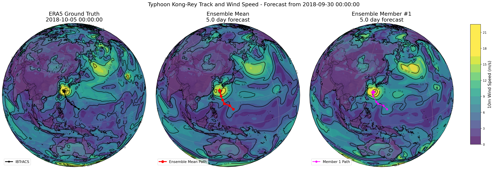
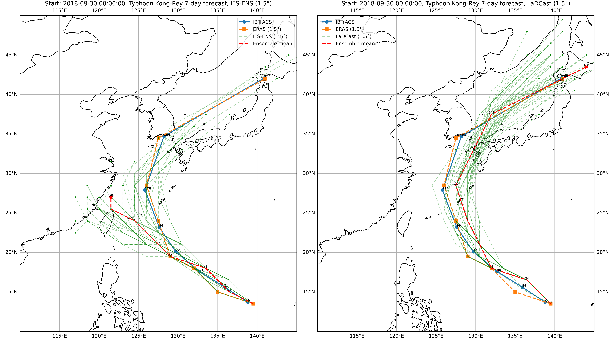

# LaDCast: Latent Diffusion model for ensemble weather forecasting

Demo: [](https://colab.research.google.com/drive/1bP3pZ7clc0Ymcgwi2KrNlCXzBthLjHkl?usp=sharing); [](https://huggingface.co/tonyzyl/ladcast/tree/main/V0.1.X/DCAE)

We introduce LaDCast, the first latent diffusion model for ensemble weather forecasting. It showcases the feasibility of using the latent approach for weather forecasting, which is an alternative approach to handling high resolution, multi-variable forecasting via the coarse model + super-resolution. Due to the size of the dataset and data I/O, we model on the 240x121 resolution, with 6 atmospheric variables: geopotential, specific humidity, u & v components of wind and vertical velocity (13 pressure levels) and 6 single variables: 10m u & v, 2m temperature, mean sea level pressure, sea surface temperature and 6-hour total precipitation (derived). The model is trained on the hourly ERA5 reanalysis dataset from 1979 to 2017. Arxiv: [LaDCast: Latent Diffusion Model for Ensemble Weather Forecasting](https://arxiv.org/abs/2506.09193)

In the Colab demo, we show AE reconstruction, ensemble forecasting and cyclone tracking. No local data needed, please feel free to try it out!

> [!NOTE]
> The code is still in development, changes are expected. The first release, V0.1.0, is the model used in the paper. The first decimal place indicates new model changes/trained.

Future work:

- Retaining high-frequency information.
- Improve the AR model's architecture.
- Scale to higher resolution.
- Test out flow-matching.

## Visualization






## Install

We recommend using the venv (py 3.11) and install via:

```bash
git clone https://github.com/tonyzyl/ladcast.git
cd ladcast
python -m venv ladcast_venv
source ladcast_venv/bin/activate
pip install -e .
# cd to executing folder
cd ladcast
```

Or using [uv](https://github.com/astral-sh/uv) (make sure you add the uv to your PATH):

```bash
git clone https://github.com/tonyzyl/ladcast.git
cd ladcast
uv venv .ladcast_venv --python 3.11 && source .ladcast_venv/bin/activate && uv pip install --upgrade pip
uv pip install -e .
# cd to executing folder
cd ladcast
```

For executing following codes, `cd ladcast` first.

## Download & preprocess the data

The 240x121 resolution can be downloaded from the google's weather bench2 cloud storage (~3TB, 1979-2022, for the 6 selected atm variables and 6 single variables), for details, check `dataloader/download.py` (Note: not all downloaded variables are used). To derive the hourly 6hr total precipitation (this approach aligns with the WB2 implementation):

```python
ds = xr.open_dataset(zarr_path, engine="zarr", chunks={"time": 1})
total_precipitation_6hr = ds['total_precipitation'].rolling(time=6).sum()
# set small negative values to zero
total_precipitation_6hr = total_precipitation_6hr.where(total_precipitation_6hr >= 0, 0)
total_precipitation_6hr = total_precipitation_6hr.rename("total_precipitation_6hr")
total_precipitation_6hr.encoding['chunks'] = (1, 240, 121)
ds_to_save = total_precipitation_6hr.to_dataset()
ds_to_save = ds_to_save.chunk({"time": 1})
ds_to_save.to_zarr(zarr_path, mode="a", consolidated=True, zarr_format=2)
```

Process into monthly tar files for building iterable dataset based on hf datasets' utilities (example):

```bash
python preprocess/xr2webdataset.py \
    --years 1990 1991 1992 1993 1994 1995 1996 1997 1998 1999 2000 \
    --ds_path "ERA5_path.zarr" \
    --output_folder "tar_files"
```

Specify the ERA5 path in `preprocess/mean_std_era5.py` and compute the mean and std of each variable.

## Train Autoencoder

```bash
accelerate launch --config_file your_accelerate_config.yaml \
    train_encdec.py --config configs/DC_AE_84_pretrain.yaml \
    --checkpoints_total_limit=2 \
    --norm_json_path=static/ERA5_normal_1979_2017.json \
    --lsm_path=static/240x121_land_sea_mask.pt \
    --orography_path=static/240x121_orography.pt \
    --encdec_cls=dcae \
    --iter_buffer_size=100
```

Fine tune the decoder with specifying the pretrained path and enabling `--ft_decoder`.

## Compress the ERA5

Setup the corresponding path in `configs/encode_dataloader.yaml` and `preprocess/encode_data.py`, then compress the ERA5 with `preprocess/encode_data.py`.

## Train the LaDCast

The 1.6B and 375M configs are provided under `configs/`, and it can be trained via:

```bash
accelerate launch --config_file your_accelerate_config.yaml \
    train_AR.py --config configs/ladcast_375M.yaml \
    --ar_cls=transformer \
    --encdec_cls=dcae \
    --lat_weighted_loss \
    --checkpoints_total_limit=5
```

Enable `--gradient_checkpointing` if GPU OOM. By default, the training script will load the compressed dataset in RAM.

## Evaluate

Example evaluation (10 samples per month, the default evalution requires the tar files):

```bash
OUTPUT_NAME="YOUR_OUTPUT_PATH"
AR_MODEL_PATH="YOUR_AR_MODEL_PATH"

accelerate launch --config_file=configs/tmp_slurm_accelerate_config.yaml evaluate/pred_rollout.py \
  --data_path=ERA5_path.zarr \
  --encdec_model=V0.1.X/DCAE \
  --ar_model_path=$AR_MODEL_PATH \
  --start_date=2018-01-01T00:00:00 \
  --end_date=2018-12-31T12:00:00 \
  --ensemble_size=20 \
  --num_inference_steps=20 \
  --return_seq_len=4 \
  --total_lead_time_hour=240 \
  --step_size_hour=6 \
  --input_seq_len=1 \
  --latent_normal_json=static/ERA5_latent_normal_1979_2017_lat84.json \
  --normalization_json=static/ERA5_normal_1979_2017.json \
  --lsm_path=static/240x121_land_sea_mask.pt \
  --orography_path=static/240x121_orography.pt \
  --save_as_latent \
  --sampler_type=edm \
  --batch_size=8 \
  --load_ds_in_memory \
  --num_samples_per_month=10 \
  --noise_level=0 \
  --output=$OUTPUT_NAME

accelerate launch --config_file=configs/slurm_accelerate_nocompile_config.yaml evaluate/evaluate_ens_gpu.py \
  --data_path=ERA5_path.zarr \
  --climatology_path=climatology.zarr \
  --result_path=$OUTPUT_NAME \
  --encdec_model=V0.1.X/DCAE \
  --start_date=2018-01-01T00:00:00 \
  --end_date=2019-01-16T00:00:00 \
  --total_lead_time_hour=240 \
  --step_size_hour=6 \
  --normalization_json=static/ERA5_normal_1979_2017.json \
  --load_ds_in_memory \
  --crop_init \
  --output=tmp/2018_375M_1to4_noise_0_ens20_step20/
```

## Hurricane tracking

Download the `ibtracs_all_list_v04r01.csv` (or request online), some examples are given as annotations in the `evluate/track.py`, or refer to the colab demo. Example:

```bash
# Typhoon Kong-rey, figsize (9, 11)

python track.py 2018271N06154 \
    --ibtracs_file=ibtracs_all_list_v04r01.csv \
    --startdate 2018093000 \
    --n_steps 28 \
    --plot_interval=4 \
    --plot_lat_range=10,50 \
    --plot_lon_range=110,145 \
    --zarr_path=path_to_era5.zarr \
    --ens_zarr=path_to_ifsens.zarr \
    --ens_dim=number \
    --plot_ens_mean \

python track.py 2018271N06154 \
    --ibtracs_file=ibtracs_all_list_v04r01.csv \
    --startdate 2018093000 \
    --n_steps 28 \
    --plot_interval=4 \
    --plot_lat_range=10,50 \
    --plot_lon_range=110,145 \
    --zarr_path=path_to_era5.zarr \
    --normalization_json=../ERA5_normal_1979_2017.json \
    --latent_path=path_to_pred.npy \
    --ens_dim=idx \
    --plot_ens_mean \
```

Note you need to provide the compressed latent file (npy files generated in pred_rollout). For 15-day, 50 trajectories, 6-hour interval forecast, the latent file is about 500MB. The ifs-ens file can be lazy loaded from WB2.

## Acknowledgements

This work was supported by Los Alamos National Laboratory under the project “Algorithm/Software/Hardware Co-design for High Energy Density applications” at the University of Michigan. We also thank the C3S and WeatherBench2 teams for making the data publicly available.
